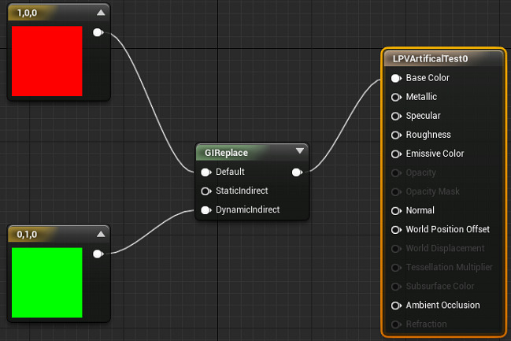

test

Here's your getting started video with Control Rig in Unreal Engine
(video was made with UE4 in mind but should be applicable to UE5)

https://youtu.be/y2WzNvJZk0E

Animation FAQ
https://forums.unrealengine.com/docs?search=FAQ%20Animation&topic=493405

https://www.youtube.com/watch?v=Oe7fYS9qxmk 

Here is a tidbit of information that I learned from my procedural animation R&D ( and with help from @p@t ):

The lighting bolt icon representing "fast path" actually means that the animation is multi-threaded, despite the underwhelming tool tip.

If a single node is missing fast path, EVERY node in the chain is single threaded (anything that doesn't take parameters will never show this icon, as its always fast path)

Simply breaking structs on an anim node will lose fast path as breaking structs is an execution

"Local to Component" and "Component to Local" nodes are extremely expensive (they rely on fast path to be affordable)

I don't know why its a subtle icon with misleading tooltip instead of a blaring red siren on every single node on the chain, but there you go.

Death Clonic — 08/05/2019
https://forums.unrealengine.com/development-discussion/animation/1395844-free-animation-toolkit-for-maya-lt-users
Unreal Engine Forums
Dear Community,

I would like to share my Maya LT animation toolkit with you for free. Download link: GoogleDrive (https://drive.google.com/open?id=1EgYnrxcrAw591g6i

jfaw — 12/18/2018
This is a really good, informative lecture by the Lead Technical Animator for Fortnite breaking down in detail how they use AnimBPs for all of their rigging and animations: https://www.youtube.com/watch?v=YjQRBHvltOk 

## Audio

Dannthr — 03/14/2022
What timing, Dave and Richard's class on Quartz was just uploaded to the free online courseware! https://www.unrealengine.com/en-US/onlinelearning-courses/quartz-music-system

Dannthr — 02/08/2021
Also, for beginners, I've compiled all our official learning resources here: https://forums.unrealengine.com/development-discussion/audio/1820471-online-learning-resources-and-livestreams-for-unreal-audio Which includes several free online video courses!

AaronMcLeran — 06/01/2018
Also, posted this to this channel a while ago 😃 
Attachment file type: acrobat
AudioEngineArchitecture.pdf

Joseph — 06/01/2018
Epic's Lead Audio Programmer ( @AaronMcLeran ) gives a full overview of audio in unreal 
https://www.twitch.tv/videos/265040293 

## Cinematics

## Datasmith

https://docs.unrealengine.com/4.27/en-US/WorkingWithContent/Importing/Datasmith/datasmith-sdk/

## geometry-scripting

https://docs.unrealengine.com/5.0/en-US/geometry-script-reference-in-unreal-engine/

## graphics

How to open a texture right from the content browser into photoshop or other image editing tools:
https://twitter.com/Luos_83/status/1498648966027694080

overlapping uv's is one of the first problems people come across.
(and one of the most common google searched for unreal engine)
its related to the lightmap uv of your mesh, generally UV1 (not UV0)
those uv's need to be within the 0-1 space, cannot be overlapping, or mirrored.
they also need padding between them, how much depends on the lightmap resolution 

how triangles work on gpu's
https://www.g-truc.net/post-0662.html
http://www.humus.name/index.php?page=News&ID=228
http://fragmentbuffer.com/gpu-performance-for-game-artists/

https://unrealartoptimization.github.io/book/pipelines/
https://jesshiderue4.wordpress.com/real-time-rendering-an-overview-for-artists/
https://unreal.tips/en/what-are-draw-calls/
https://simonschreibt.de/gat/renderhell/

UE4 Texture/Material/Cascade optimization tips:
https://docs.google.com/document/d/1-guvLUfwk7fcVOuHCTEehJWf7i6AoDoU65jIKwSIG6Q/edit?usp=sharing

Luos - Yoeri Vleer — 03/26/2021
written by @Deathrey:

What is a grass cluster? Hand placed stack of leaf cards, that is usually 8 tris
So what if:you use generic mesh for all clusters, and then tap into atlas texture, that stores positions of vertices and normals for each of mesh variation?
Eight, you can reduce draw calls on grass ten times and increased vertex shader complexity.
You should have an idea now.
Same shit for small rocks and scatters alike.

GOD of creating empty projects — 05/08/2020
All you need to know about Textel Density by Leonardo Lezzi
https://www.artstation.com/artwork/qbOqP
in the description there is a gumroad link where he has a pdf to download, you can just write 0$ if you don't have money to spare. 

GlassBeaver — 12/04/2018
@Mich https://www.tomlooman.com/outline-effect-in-unreal-engine-4/

jfaw — 06/19/2017
Hey guys I discovered a really good series of lectures about art and lighting in the context of Unreal.  I made it all into a playlist becuase the guy didn't bother to do it on his own.  Here's the link:  https://www.youtube.com/playlist?list=PLDGhmw7qiWG60w9HlBV2j5bmvYl_r-iyo

jfaw — 05/14/2017
Here's a really good Advanced Materials course on Youtube: https://www.youtube.com/playlist?list=PLuB7NQxkpPJF5ZfJKKNlGVzundVz2VF-_ 

## level-design

Most people come here and ask environment art questions and leave without answers because they mostly confuse what level design is, because of the term ambiguity. This video might help to understand what level design really is: https://www.youtube.com/watch?v=IcCFto0u_g4

rezonant — 05/08/2022
PSA: is your huge landscape being weird? has it become entirely flat? are you suddenly getting VRAM exhausted on a 12GB card? getting crashes while editing your huge landscape? is the landscape flickering on component boundaries? all these problems and more might be solved by just moving it on any axis by 0.01 and then moving it back (not using undo). 

CE — 03/17/2022
I also wanted to link this, which I think highlights some gotchas that are often associated with LD: https://www.henrytoftsld.co.uk/post/tips-for-level-design-applicants-from-a-hiring-manager 

Conrad — 12/29/2021
http://www.philipk.net/tutorials.html < good to understand modular construction sets
https://www.thiagoklafke.com/tutorials/modular-environments/ < thorough breakdown of texture-first design, use of grid and pivots
http://blog.joelburgess.com/2013/04/skyrims-modular-level-design-gdc-2013.html < Talks about the Skyrim level design approach
https://www.slideshare.net/JoelBurgess/gdc-2016-modular-level-design-of-fallout-4 < Covers the improvements from the Skyrim/Fallout 3 levels (it repeats the 2013 talk until around slide 90) which simplifies the kit uniqueness
https://docs.unrealengine.com/udk/Three/rsrc/Three/ModularLevelDesign/ModularLevelDesign.pdf < modular design differences when using Unreal
https://polycount.com/discussion/116526/hirstarts-and-what-he-can-teach-environment-artists-about-modularity < "double-sided" design concept for when walls exist on both sides (whether its to separate rooms or int/ext)
http://www.kevinjohnstone.com/Help/Modular%20Environment%20Design.rar < (beware download link!) modular approach of gears of war for Unreal
https://polycount.com/discussion/130848/udk-gears-of-war-inspired-environment-modular < "fan art" GoW style architecture - not sure, but i think there is some BSP for walls and floors to accomplish unique slants and spaces

Main take away is to design to a grid, concern over your pivot points, and blockout/grey box the kit before committing to details (maybe even texturing) as collision and flow are more important. To what Joel Burgess says, it can't be generic, or shouldn't be thought of as a "solve all" kit. It should solve the problems of that kind of architecture (cathedral, dungon, space station, etc.). I like the Fallout 4 method due to it's simple amount of assets for architecture (and the naming convention simplicity) but Unreal needs thickness, otherwise its been a pretty sound method for me. Its basic boxes anyways since the majority of the level then gets covered in detail meshes.

Dash — 11/17/2021
Incidentally, in the process of figuring out that my issue wasn't Landmass related, I ended up documenting most of the useful fields on the Landmass actor in my notes (much of which also applies to the water system). In case anyone is looking for such a thing in the future, thought I'd share since I didn't find any documentation to speak of when I searched for it: https://docs.google.com/document/d/e/2PACX-1vSudLgzRnW43Y33jFAnFH_-wiLzUfq1KAcPe2fmfaOmkiVPj6iuJ_ZBLMu3ihvO4HPPyd5_ExXZfDEQ/pub 

Tzupi — 07/22/2021
File per actor is in 4.26 as well but it is amazingly undocumented. Right click on a sublevel and select “convert to external actors” or something like that. It will convert the sublevel to File per Actor version. It is quick and reversible at any point.

## lighting

Let me start by posting the solution to probably 10% of the questions that will be posted here

## lumen

https://www.youtube.com/watch?v=1e6oOiKh91U

https://i.gyazo.com/67a53e67cf55af657d310d949ecaa08a.jpg

## materials

what values do materials have when nothing is plugged in? Well, now you know  

Base-Values for material (when nothing is plugged in):  

Learn the many ways to work with Materials in the engine, starting with an introduction to the general behind the scenes architecture, the concept of physically-based rendering (PBR), and how to work with textures.

https://dev.epicgames.com/community/learning/courses/2dy/unreal-engine-materials-master-learning/bVy/introduction

## metahumans

MetaHuman Resources
MetaHuman Creator FAQ: https://www.unrealengine.com/en-US/faq?active=metahuman-creator
Request early access to MetaHuman Creator: https://www.unrealengine.com/en-US/metahuman-creator-apply
Launch the app (once you have access): https://metahuman.unrealengine.com/

Docs
MetaHuman Creator User Guide: https://docs.metahuman.unrealengine.com/en-US/UserGuide/
MetaHuman Creator How-Tos: https://docs.metahuman.unrealengine.com/en-US/HowTos/
Using MetaHumans in Unreal Engine: https://docs.metahuman.unrealengine.com/en-US/MetahumansUnrealEngine/

Videos
MetaHuman Performance and Scalability Settings: https://youtu.be/bPMEASc1rbo
Using the MetaHuman Facial Rig in UE: https://youtu.be/GEpH3o44_58
Animating MetaHumans with Control Rig in UE: https://youtu.be/2k2gNc_7CT0

## nanite

https://www.youtube.com/watch?v=eviSykqSUUw
https://www.youtube.com/watch?v=-50MJf7hyOw
https://www.youtube.com/watch?v=TMorJX3Nj6U 

https://www.youtube.com/watch?v=NRnj_lnpORU

How do you enable Nanite in a project? 
https://forums.unrealengine.com/docs?topic=543824

People are getting confused by "shader model". Honestly, ignore that. Shader model != feature level (since DX12). Also what UE calls "shader model" is mostly unrelated to both.

How to troubleshoot Nanite not working:
- Nanite requires DX12 with an up-to-date version of Windows (revision 1350+ for Windows 10 1909, revision 789+ for 2004/20H2 : https://devblogs.microsoft.com/directx/wp-content/uploads/sites/42/2021/04/Aboutmenu-768x571.png)
- Nanite requires the latest drivers available (GameReady drivers for Nvidia)
- Make sure your Default RHI in Project Settings / Rendering is set to DX12, not "Default" or "DX11" (enabling the experimental DX12 SM6 RHI is not required for now) and restart the editor
- In the engine log, make sure you can find something like this to confirm DX12 is running: "LogD3D12RHI: Found D3D12 adapter 0: `<your GPU model go here>` (Max supported Feature Level 12_1, shader model 6.6
- In the engine log, make sure you can find "atomic64" as "supported" (this means Nanite is supported by your GPU+OS+driver)
- Try the Nanite Triangles view under the "Lit" button in viewport to confirm whether it works, check that it shows multicolored geometry, don't rely on visual appearance or wireframe as they can be very counter-intuitive! 

Yes also this is very important for virtual shadow maps. Not only does Nanite stuff render far more efficiently into VSMs but Nanite objects can occlude non-nanite stuff from invalidating cached shadow pages, but not the other way around. So if for instance you have a big building and a person walking around entirely in its shadow, those shadow pages can stay cached if the building is Nanite, but if it is non-nanite the person's movement will cause them to be invalidated. Thus it's quite important for large light blockers to be Nanite for VSMs 

https://www.g-truc.net/post-0662.html
http://fragmentbuffer.com/gpu-performance-for-game-artists/
http://www.humus.name/index.php?page=News&ID=228 

## Niagara

if you really wanna learn more about materials (and vfx)
http://www.tharlevfx.com/reading-list

Short and to the point Niagara videos:
https://www.youtube.com/playlist?list=PLuGJ2Hd3jyy3ds-0Q333oaHXvL7rL_T1K

Niagara 101:
https://www.youtube.com/playlist?list=PLHjQE2fLIZu97z7Iwf-PjV2e1Y4_k2GKL 

Niagara Debugging and Optimization:
https://docs.unrealengine.com/5.0/en-US/debugging-and-optimization-in-niagara-effects-for-unreal-engine/

Niagara should not be used to drive gameplay logic. Nobody will stop you, but you will run into problems when your simulation drops results because of visibility culling, scalability culling, readback delay, etc. Also, Niagara simulations are not replicated on the network and don't run on server instances, so multiplayer would be impossible that way.

Official Niagara Documentation:
https://docs.unrealengine.com/en-US/Engine/Niagara/index.html

Getting started tutorial for Niagara:
https://realtimevfx.com/t/niagara-unreal-gdc/4359/47

1MaFX showing a ground break spell with some base info:
https://www.youtube.com/watch?v=Ba-U3rSAM4Y

Niagara tutorials by Art Hiteca:
https://www.youtube.com/watch?v=q4LdwbifKVY&list=PLcnm14M-VSVyUBngJpQ9WTLVpc2mwevgz

Somewhat more abstract niagara vfx tutorials by Bleeck:
https://www.youtube.com/playlist?list=PLcDcPCfgLOnCzYTufd6DXOJ-6-oacih_D

Procedural vfx by Ash Oakenfold: (scroll down)
https://www.patreon.com/cannabis_cod3r 

https://docs.unrealengine.com/en-US/Engine/Niagara/index.html

## paper-2d

If you are working with a topdown project and are attempting to make your character look like they're behind things when you're above them, set the "Translucent Sort Policy" to "Sort along axis"  under the rendering section of project settings:

## sequencer

## virtual-production

## visual-fx

