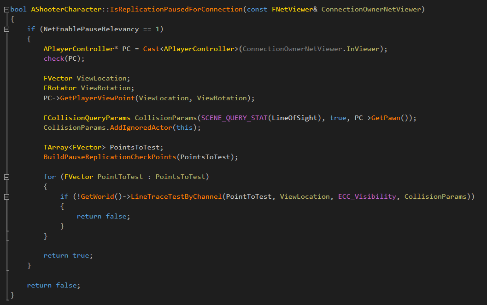

## blueprint


https://www.unrealengine.com/en-US/blog/collision-filtering


When to avoid and when to use Event Tick:
https://twitter.com/MrTapa/status/1165781662623514624 

https://blueprintue.com/

If anyone wants an explanation of BP execution rules (difference between impure and pure nodes) https://www.youtube.com/watch?v=PRqOtCrBDN8


https://docs.unrealengine.com/en-us/Engine/Blueprints/UserGuide/Debugging


https://www.youtube.com/watch?v=0Cmr4maZEyYv


FYI, we just posted up a new blog post on the Coconut Lizard website ... Blueprint Nativization - lots of fixes and improvements... as well as how to use it etc. http://coconutlizard.co.uk/new/programming/placatingthenatives/


https://www.youtube.com/watch?v=EM_HYqQdToE


https://docs.unrealengine.com/5.0/en-US/unreal-engine-actor-lifecycle/


## cpp


Yes, FString widens all strings so declaring it with TEXT() is preferable, however with FName it can use different char types so it will actually check wide strings and if it doesn't need to be wide it'll narrow it down. This means it's slightly more inefficient passing a basic string via TEXT() as it'll end up narrowing anyways


https://benui.ca/unreal/ui-bindwidget/
https://benui.ca/unreal/uproperty/ 

https://benui.ca/unreal/subsystem-singleton/ 


Usage of subsystems would be much simpler with
https://unrealengine.com/marketplace/en-US/product/subsystem-browser-plugin
https://github.com/aquanox/SubsystemBrowserPlugin

Hey guys, I wrote a blog post with a short explanation about the most common issues I see in this cpp chat and some useful beginner tips: https://tackytortoise.github.io/2022/06/24/common-slacker-issues.html


it's worth reiterating that you DO NOT TURN OFF LIVE CODING 


There's a -WaitForAttach flag that will cause the application to wait until a debugger is attached


just live by this mantra: "uobject constructors are only useful for setting default settings for the blueprints you will eventually create and actually use in your game"


C++ Tutorials
- https://www.unrealengine.com/en-US/onlinelearning-courses/converting-blueprints-to-c
Converting Blueprints to C++
- https://www.youtube.com/watch?v=6485d5Zoc_k
- https://stackoverflow.com/questions/388242/the-definitive-c-book-guide-and-list 


http://hotreloadsucks.com/


```cpp
UENUM(BlueprintType)
enum class EThing : uint8
{
    A,
    B,
    C,
    MAX    UMETA(Hidden),
};

UPROPERTY(EditAnywhere, Category = "Restrictions", meta = (Bitmask, BitmaskEnum = "EThing"))
uint32 Mask;

FORCEINLINE bool HasMask(const EThing Val) const { return (Mask & (1 << static_cast<uint8>(Val))) != 0; }
```


There's a whole framework for building custom editor tooling. Ryan Schmidt did a nice in depth write up on it a while back: http://www.gradientspace.com/tutorials/2021/01/19/the-interactive-tools-framework-in-ue426


All UObject-derived classes get typedefs for themselves called ThisClass and their base class called Super.

You can use this to easily call your base implementation in virtuals:

```cpp
virtual void Foo() override
{
    Super::Foo();
}

Or to make a member function pointer for delegates:
void Bar()
{
    MyDelegate.AddDynamic(this, &ThisClass::Foo);
}
```

```cpp
#include "HAL/PlatformStackWalk.h"
...
const uint32 DumpCallstackSize = 2047;
ANSICHAR DumpCallstack[DumpCallstackSize] = { 0 };
FPlatformStackWalk::StackWalkAndDump(DumpCallstack, DumpCallstackSize, 2);
UE_LOG(SimTickerSubsystemLog, Log, TEXT("stacktrace: %s"), ANSI_TO_TCHAR(DumpCallstack));
```


FRunnable launches new thread. you use this for long lasting workers usually. Task graph works best with short work jobs can land on game thread as well. Thread pool allows to queues a job onto the internal created threads grouped in a pool. Async is just a wrapper for all 3 of them. AsyncTask is a wrapper for taskgraph. 


put PRAGMA_DISABLE_OPTIMIZATION above that one function, and PRAGMA_ENABLE_OPTIMIZATION below 


https://wholetomato.com/


https://www.unrealengine.com/en-US/blog/debugging-ufunction-invoke


Extensive UE4 specifier/metadata listings (scroll down to the bottom of the Enums section):
https://docs.unrealengine.com/latest/INT/API/Runtime/CoreUObject/UObject/index.html


## multiplayer


https://wizardcell.com/unreal/persistent-data/


vori — 05/21/2022.   
Some multiplayer articles I wrote:  
- Multicast/Client RPCs VS OnReps (Towards stateful replication):
https://vorixo.github.io/devtricks/stateful-events-multiplayer/
- How to replicate thousands of Actors efficiently (network managers):
https://vorixo.github.io/devtricks/network-managers/
- A better and non-destructive synced network clock:
https://vorixo.github.io/devtricks/non-destructive-synced-net-clock/ 


https://www.youtube.com/watch?v=RtQRMcupJs0&ab_channel=ReidsChannel 


Experimental: Sample Code for Implementing Instant Replays
https://forums.unrealengine.com/t/experimental-sample-code-for-implementing-instant-replays/264946


(Not me or my video) For those of you, who don't want to read through 100+ pages of information, but just watch some nice slides and listen to some calming voice to learn the basics of multiplayer:
https://www.youtube.com/watch?v=JOJP0CvpB8w

Link to my Multiplayer Network Compendium | 100+ Pages to get started with Multiplayer in UE4
https://cedric-neukirchen.net/


How to call RPC's inside a UObject  https://www.thegames.dev/?p=45 


If you are having issues running a steam dedicated server and a client on the same machine, try launching the server with the -force_steamclient_link command line parameter

https://www.youtube.com/watch?v=tOy0xYaP3wA

https://www.youtube.com/watch?v=09yWANtKmC8

https://www.youtube.com/watch?v=VusAHXoHF3Y

https://www.youtube.com/watch?v=_8A2gzRrWLk


https://github.com/staticJPL/UE4SequenceCharacterMovement/blob/master/UE4MovementNetCodeSequence.pdf


- https://docs.unrealengine.com/en-us/Gameplay/Networking/OnlineBeacons
- https://forums.unrealengine.com/community/community-content-tools-and-tutorials/1355434-onlinebeacons-tutorial-with-blueprint-access
- https://answers.unrealengine.com/questions/467973/what-are-online-beacons-and-how-do-they-work.html
- https://forums.unrealengine.com/development-discussion/c-gameplay-programming/85348-party-beacon-how-does-it-work-o-o
- https://github.com/EpicGames/UnrealEngine/blob/release/Engine/Plugins/Online/OnlineFramework/Source/Lobby/Public/LobbyBeaconClient.h
- https://github.com/EpicGames/UnrealEngine/blob/release/Engine/Plugins/Online/OnlineSubsystemUtils/Source/OnlineSubsystemUtils/Public/PartyBeaconClient.h

```cpp
if ((Target.Platform == UnrealTargetPlatform.Win32) || (Target.Platform == UnrealTargetPlatform.Win64) || (Target.Platform == UnrealTargetPlatform.Linux) || (Target.Platform == UnrealTargetPlatform.Mac))
{
    GlobalDefinitions.Add("UE4_PROJECT_STEAMPRODUCTNAME=\"My Product Name\"");
    GlobalDefinitions.Add("UE4_PROJECT_STEAMGAMEDIR=\"My Game Dir\"");
    GlobalDefinitions.Add("UE4_PROJECT_STEAMGAMEDESC=\"My Game Desc\"");
    GlobalDefinitions.Add("UE4_PROJECT_STEAMSHIPPINGID=480");
}
```


just unlocked in the vault (from GDC 2017):
https://www.gdcvault.com/play/1024010/Replicating-Chaos-Vehicle-Replication-in
https://www.gdcvault.com/play/1024035/Deterministic-vs-Replicated-AI-Building
https://www.gdcvault.com/play/1024041/Networking-Scripted-Weapons-and-Abilities 


https://www.youtube.com/watch?v=W3aieHjyNvw

http://www.aclockworkberry.com/custom-struct-serialization-for-networking-in-unreal-engine/#NetDeltaSerialize_and_Fast_TArray_Replication


https://www.unrealengine.com/en-US/blog/epic-2019-cross-platform-online-services-roadmap


https://www.youtube.com/watch?v=h47zZrqjgLc


https://github.com/error454/CharacterMovementReplication-UE4


* Steam works out of the box in unreal. There is no need to setup. Just activate the plugin.
* When testing the steam integration you need to have steam running.
* Launching the game via PIE will not start the steam online subsystem. So PIE is a no go for testing.
* The Standalone version seems to be fragile when trying to connect / host a listen server sessions. Sometimes it works sometimes not. Use a packaged build or start it via the DebugGame / DevelopmentGame targets. This could be due to the test appid.
* When testing, both steam applications needs to be on the same download region.
* For proper steam integration tests you should use two seperate machines.
* The SteamDevAppId property in the DefaultEngine.ini is only for developme.nt builds
  * For shipping builds you need to put an steam_appid.txt file inside your win64 folder.


As far as smarter selection goes, I used halo 3 as a rough guide of a "good" system, you can read about it here: http://halo.bungie.org/misc/fyrewulff_spawnsystem/

https://youtu.be/ueEmiDM94IE?t=1413 


https://www.unrealengine.com/en-US/blog/unreal-engine-improvements-for-fortnite-battle-royale

https://www.unrealengine.com/en-US/blog/finding-network-based-exploits





http://orfeasel.com/networking_intro_p1/


https://github.com/moritz-wundke/MPTwinStickShooterWithUE4


## online-subsystems

UE4 Multiplayer Sessions in C++ - Code Examples - GitHub Repository
https://cedric-neukirchen.net/2021/06/27/ue4-multiplayer-sessions-in-c/


For anyone wanting to start with beacons (pretty much a necessity for party systems but also for reserving spots on a server):

First make sure you understand how RPCs are done in C++ (yeah C++ can't be avoided I'm afraid)
https://docs.unrealengine.com/4.26/en-US/InteractiveExperiences/Networking/Actors/RPCs/

Next the best tutorial out there:
https://forums.unrealengine.com/t/onlinebeacons-tutorial-with-blueprint-access/100043

But make sure you also read the answer by the very creator of beacons here:
https://answers.unrealengine.com/questions/467973/what-are-online-beacons-and-how-do-they-work.html

There are 3 important classes when it comes to beacons: AOnlineBeaconClient, AOnlineBeaconHost and AOnlineBeaconHostObject

You inherit AOnlineBeaconHost and make your own implementation, in the tutorial the PingBeacon(Client/Host/Object) implementations expose everything to Blueprint.
Here the tutorial is a bit wrong. You can also activate the Host by calling
`BeaconHostListener->PauseBeaconRequests(false);`


Now you have your Beacon Host. The most important methods are InitHost() (to start it) and RegisterHost() to register a Beacon Host Object (so basically a host ready to receive a specific Beacon Client implementation).
The comments above the method say this:
`Register a beacon host and its client actor factory`

Here is what the beacon programmer (Crzyhomer) says:
`has a registry of AOnlineBeaconHostObjects (via RegisterHost()) that to route all traffic based on type`


So you can add as many OnlineBeaconHostObject implementations to your Host as you want (a party beacon, a reserve beacon, a server info beacon, ...). It will be able to differ based on type

Here is where it gets fun and confusing. Many AOnlineBeaconHostObject implementations are called just 'Host'. E.g. ALobbyBeaconHost inherits from AOnlineBeaconHostObject 


Plugin that exposes C++ Session related code to Blueprints to allow Blueprint Users to utilize Sessions to a greater extend. Without this you will either have to live with the native, very simple nodes from Epic or dive into C++ yourself.

https://forums.unrealengine.com/t/advanced-sessions-plugin/30020


This is what the creator of beacons had to say. I found it very enlightening 

```
Gears 3 used beacons to reserve space in game. That way we could test many servers for space and travel to only one, knowing that you were definitely going to get into the game. It avoided contention when thousands of users all received the same 20-50 search results but only 10 could join per match. However, in UE3, this was TCP/IP and the protocol had to be implemented manually not using any reflection by UObject.

In UE4, we decided that our already existing network code was so robust and powerful, why reinvent the wheel? So I made the AOnlineBeacon class to leverage all the RPC and replication power of AActor.
```


## epic-online-services

This is our public roadmap for Epic Online Services https://trello.com/b/rLvzFJfE/eos-public-roadmap 

The official place to get help for EOS is https://eoshelp.epicgames.com/s/ 


Epic Online Services (EOS) provides cross-platform game services (Lobbies, Stats, Achievements, etc.). These can be used from any platform (Steam, Epic Games, PSN, Xbox, etc.) and allow you to support cross-progression by authenticating using a platform account and connecting that to an EOS User using the EOS_Connect interface.

To use EOS_Connect, you will have to use an identity provider because EOS does not support authentication (there is no login), as such you have to have an integration with an external platform. This can be a platform such as Steam, Xbox, PSN, Nintendo or it can be a custom platform that exposes an OpenID interface. You can also use Epic Account Services (EAS) to connect to EOS, but this is not required.

An EOS User will have two identifiers, EOS Organization User ID and EOS Product User ID. Most EOS interfaces will expect an EOS Product User ID. To help explain the reason these exists, you can think of it as having an Account ID (Organization User ID) and a Game Profile ID (Product User ID). The Organization User ID will have one Product User ID for each product. With this abstraction, you have the ability to move profiles between accounts when supporting players.

Epic Account Services (EAS) allows you to support login with Epic Accounts in your game, and with that, access to Epic social services such as Friends and Presence. That being said, EAS is not required to use EOS, but it can be used as a way to connect to an EOS User. Any interface that requires EAS will have a banner in the documentation stating that EAS is required.

Aside from access to Epic Friends, the benefit of using EAS is having a platform that supports cross-platform linking including the means to login from any platform, link multiple platform accounts into a single account, and interfaces (epicgames.com/account) and support around that.


https://dev.epicgames.com/en-US/services

https://www.unrealengine.com/en-US/blog/epic-online-services-featuring-epic-account-and-game-services


## chaos-physics


https://docs.unrealengine.com/5.0/en-US/physics-in-unreal-engine/


legacy physics:
https://avilapa.github.io/post/framerate-independent-physics-in-ue4/
https://gist.github.com/vorixo/3743e3c095315f334e28047bb5960d25


## ai

Two videos to watch before designing your AI, that explains philosophy and ideal workflow for AI development:
https://youtu.be/G5A0-_4dFLg
https://www.youtube.com/watch?v=5ZXfDFb4dzc

https://twitter.com/AIGPG/status/1222599378042597378

The Behavior Tree tutorial video that was posted the other day is really good! Here's a link to the full series (5-videos, each about half an hour long): https://www.youtube.com/playlist?list=PLUUXnYtS5hcX5Bq3WRCnkI-p2PW6PBulP
(For those of you who have done AI tutorials in the past and alreaady know the basics, just skip to the final video of the series)

This is a much shorter video that they did to introduce you to the concepts: https://www.youtube.com/watch?v=nshHCycft4A

Here's a really good source @PandaGod posted earlier for learning about AI tricks and topics:  http://www.gameaipro.com/GameAIPro/

https://www.youtube.com/playlist?list=PLbRBWFaQHaW__LcCtV-KnqqgIFOyyFhr5


## engine-source

https://github.com/EpicGames/UnrealEngine

Epic strictly adheres to the Coding Standards outlined in the Documentation when dealing with community PRs
https://docs.unrealengine.com/en-us/Programming/Development/CodingStandard

## editor-scripting


Scripting and Automating the Editor
https://docs.unrealengine.com/en-us/Editor/Scripting-and-Automating-the-Editor

Scripting the Editor with Blueprints
https://docs.unrealengine.com/en-us/Editor/Scripting-and-Automating-the-Editor/Scripting-the-Editor-using-Blueprints

Scripting the Editor with Python
https://docs.unrealengine.com/en-us/Editor/Scripting-and-Automating-the-Editor/Scripting-the-Editor-using-Python

Editor Scripting How-Tos
https://docs.unrealengine.com/en-us/Editor/Scripting-and-Automating-the-Editor/Editor-Scripting-How-Tos 


## gameplay-ability-system

https://github.com/tranek/GASDocumentation 


Video and docs coming eventually, but quick high level overview:

Experience:
- List of Game Feature Plug-ins to activate
- Pawn Data describing the ‘hero’ that player or bots control
- List of Actions to perform when loading the Experience

Game Feature Plugin:
- Game logic dynamically controls activation at runtime
- Lists actions to perform when activated
- Easily extend the Asset Manager

- Enforced modularity
    - Only reference content from the base game and other explicitly listed features
    - Enables games to safely exclude prototype features from releases

Action:
- Contained in Game Features and Experiences

- Can preload assets and run code when activated / deactivated

- Some common actions:
    - Add Abilities
    - Add Components
    - Add Widgets

Pawn Data:
- Describes what goes into the ‘hero’ that player or player bots control

- What do you see?
- Player pawn class
- Default camera mode

- What can you do?
    - Ability sets to grant
    - Ability relationship mapping
    - Input configuration

Ability Set:
- List of Abilities, Gameplay Effects, and Attributes bundled together as a group.

- Sets can be granted by:
    - Hero data
    - Actions in Experiences
    - Actions in Game Features
    - Equipment

User-Facing Experience
- User-facing experiences tie together a Level and Experience, and describe how to present it in the front end


Advanced networking optimization techniques for GAS.
https://vorixo.github.io/devtricks/gas-replication-proxy/

Covers: Secure initialization, Replication proxies (IAbilitySystemReplicationProxyInterface), adaptative net update frequency, bitmasking and more!

GAS + Input mapping for multiplayer games (enhanced input plugin):
https://vorixo.github.io/devtricks/gas-input/


If you are looking a bare-bones GAS set-up, feel free to check out my Github project here!
https://github.com/Narxim/Narxim-GAS-Example


Kaos has a blog of tips, tricks and stuff for Gameplay Ability Systems, you can take a look here https://www.thegames.dev/?cat=4


I made public my advanced FPS/TPS sample project https://github.com/tranek/GASShooter

Concepts covered:
1. Ability Batching
2. Equippable weapons that grant abilities
3. Predicting weapon switching
4. Weapon ammo
5. Simple weapon inventory
6. Headshot bonus damage
7. Reusable, custom TargetActors
8. ReticleActors
9. Play replicated montages on multiple Skeletal Mesh Components belonging to the AvatarActor in an ability
10. Subclassing FGameplayEffectContext to send additional information to GameplayCues
11. Character shield that drains before health is removed by damage
12. Item pickups
13. Simple one button interaction system 


https://github.com/Pantong51/GASContent


Here are the answers to the questions about GAS and networking that I received, Dave Ratti was the primary contributor if you want to give thanks!: https://epicgames.box.com/s/m1egifkxv3he3u3xezb9hzbgroxyhx89

https://docs.unrealengine.com/en-us/Gameplay/GameplayAbilitySystem


https://docs.unrealengine.com/en-us/Resources/SampleGames/ARPG


https://wiki.unrealengine.com/GameplayAbilities_and_You
https://www.youtube.com/watch?v=Ev2P6BTUxN0
https://docs.google.com/presentation/d/1GeuDO2as1b12ei5OHh6jyfxczVYymXJQDBWoRLDMpOI/edit#slide=id.g38b84aa984_0_32
https://github.com/michaeltchapman/MCGameplayAbilities


Resources: 
Gameplay Ability Sample Project: https://github.com/daveratti/GameplayAbilitiesSample
Gameplay Ability Wiki Page: https://wiki.unrealengine.com/GameplayAbilities_and_You
Deep Dive into Attributes: https://forums.unrealengine.com/showthread.php?143688-Comprehensive-GameplayAbilities-Analysis-Series&p=702209 


## mass


https://www.youtube.com/watch?v=f9q8A-9DvPo

Community Sample Project
https://github.com/Megafunk/MassSample 


## enhanced-input-system

https://miro.com/app/board/uXjVPZ05TAg=/?share_link_id=63686690410 


Another tiny change I did to Lyra's code, which is slightly related:

```cpp
UENUM(BlueprintType)
enum class ECustomAbilityActivationPolicy : uint8
{
    Default, // <<<<<<<<<<<<<<<<<<<
    OnInputTriggered,
    WhileInputActive,
    OnSpawn
};
```


I added that "Default" entry into the ActivationPolicy, because by default, with Lyra's code, Abilities either have an InputTag or they don't. And if they have an InputTag, they are meant to trigger the Ability with the "OnInputTriggered" or "WhileInputActive" options.

If you don't want that you would not give it an InputTag. The problem for us was that we had an ability that didn't activate on either of those 3 options, but it still needed the InputTag, because we want to have the WaitInputPressed/Released nodes.

So we added "Default", which allows us to mark it as not activating with Spawn or Input, and we can still give it an InputTag for the WaitInput Tasks.


So here are the small changes I did to how Lyra binds to the GAS Pressed and Released events.

https://dev.epicgames.com/community/snippets/91m/unreal-engine-input-action-gas-binding

One difference is that I put the InputTag into a custom InputAction, instead of a Struct. That way I can extract it from a InputAction asset when needed (I don't always have access to the Struct that Lyra uses).

The other difference is that I completely removed the "Completed" Trigger for the GAS Released event. 

The reasons behind that are:

"Completed" is the State a Trigger goes in when "Completing". That means if you only add a PressedTrigger to your InputAction, that PressedTrigger will "Trigger" and instantly "Complete" when pressing it. This causes the GAS binding to call "Pressed" and instantly "Released", even if you still hold the key.

Another reason is my understanding of how Triggers should work. E.g. if I only add a "Pressed" Trigger, I don't want a Key Release to Trigger the InputAction. With Lyra's setup, even if one adds a ReleasedTrigger, it will trigger Released on Pressed, which is wrong in my opinion.

That does of course mean that if you need both Pressed and Released to Trigger your InputAction, that you need to add those two Triggers. But that's kinda logical to me.

So what am I actually using to check if the Key is Pressed or Released?

My function Triggering for Pressed and Released Triggers of course doesn't tell me much.
That's why I use the signature that provides me with a "FInputActionInstance" parameter, which gives me for one the InputAction (I can get the InputTag from that to find the matching Ability) AND the FInputActionValue, which is the actual value of the Key/Axis. Given my InputActions are bool based, that's just true or false.

So in the snippet above you will see that I only bind to Triggered, I check the Value for Pressed vs Released and my InputAction asset would have a Pressed and a Released Trigger for this.

That's my understanding and everyone here can obviously disagree.
I did however find that this is way closer to how the original system works and it removes the bug that GAS AbilitySpecs have "InputPressed = false" even though I haven't released the Key yet. 


## game-features-system

n/a

## modular-gameplay-plugins

n/a


## plugins


the video moved to Unreal Academy a few months ago: https://learn.unrealengine.com/course/2436528?r=False&ts=637058066219946059


https://github.com/ue4plugins 


https://twitter.com/kantandev/status/1038037592174981121


By the way, you can run the following script (put all plugins into some temp project):
`RunUAT.bat RebasePublicIncludePaths -Project="Path/To/TempProject.uproject" -UpdateDir="Path/To/TempProject/Plugins" -write`

https://twitter.com/gmpreussner/status/971820338957963264


Okay, so just some getting started/resources I'd like to link for anyone getting started with plugins 😃

Creating Your First Plugin (get started with plugin development; the things shown here are  currently outdated, but still useful in some places. I'd reccomend starting with a blueprint function library (Plugins -> New Plugin -> Blueprint Function Library) as this contains a simple to understand example, and will generally be one of the most common things you'll want to do): https://wiki.unrealengine.com/An_Introduction_to_UE4_Plugins

Linking Static Third Party Libraries (allows you to "communicate" with externally compiled c++ code, great for adding libraries for things like SDKs for for example RGB keyboards) https://wiki.unrealengine.com/Linking_Static_Libraries_Using_The_Build_System

(Mainly Mobile) UPL Documentation (this allows you to add libraries/do things while packaging for android (and possibly some other platforms). It's documentation is generally hard to find, as it's in the actual time itself) https://github.com/EpicGames/UnrealEngine/blob/master/Engine/Source/Programs/UnrealBuildTool/System/UnrealPluginLanguage.cs

The UE4 Source, Your Best Friend (the Unreal Engine 4 source will probably be your best friend in this plugin creating venture! It's full of great examples, and can help you where the documentation doesn't. NOTE: You will need to link your github account to your epic games account if this page shows a 404 error) https://github.com/epicgames/unrealengine


Here is the Michael Noland video (I was just looking into this myself): https://www.youtube.com/watch?v=zg_VstBxDi8


